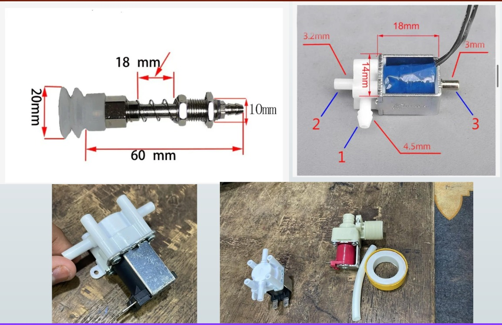
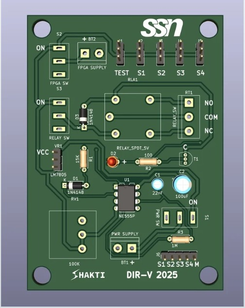
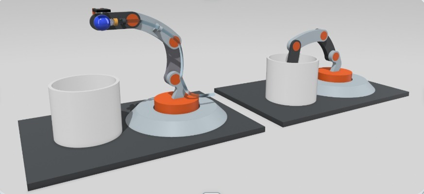
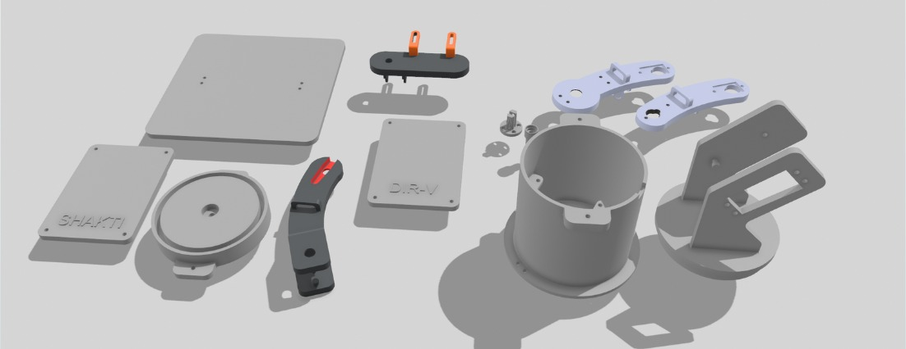
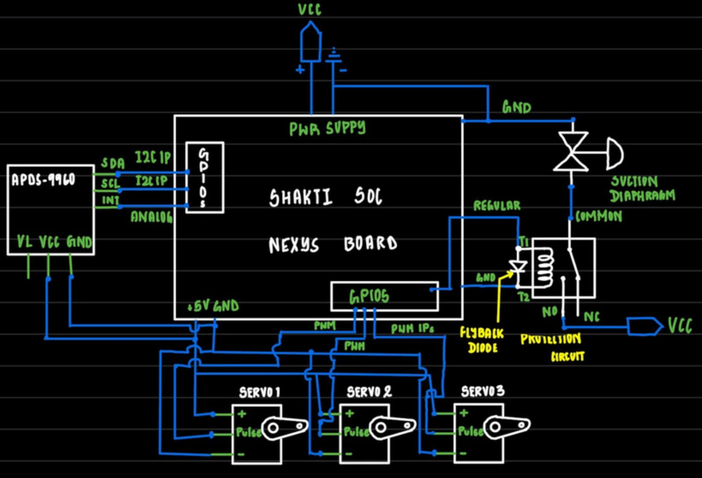
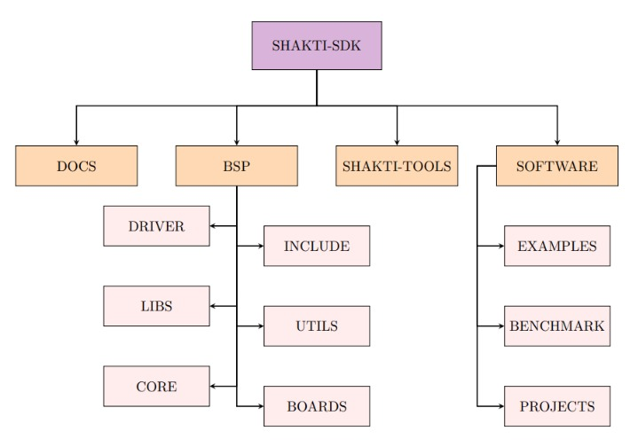
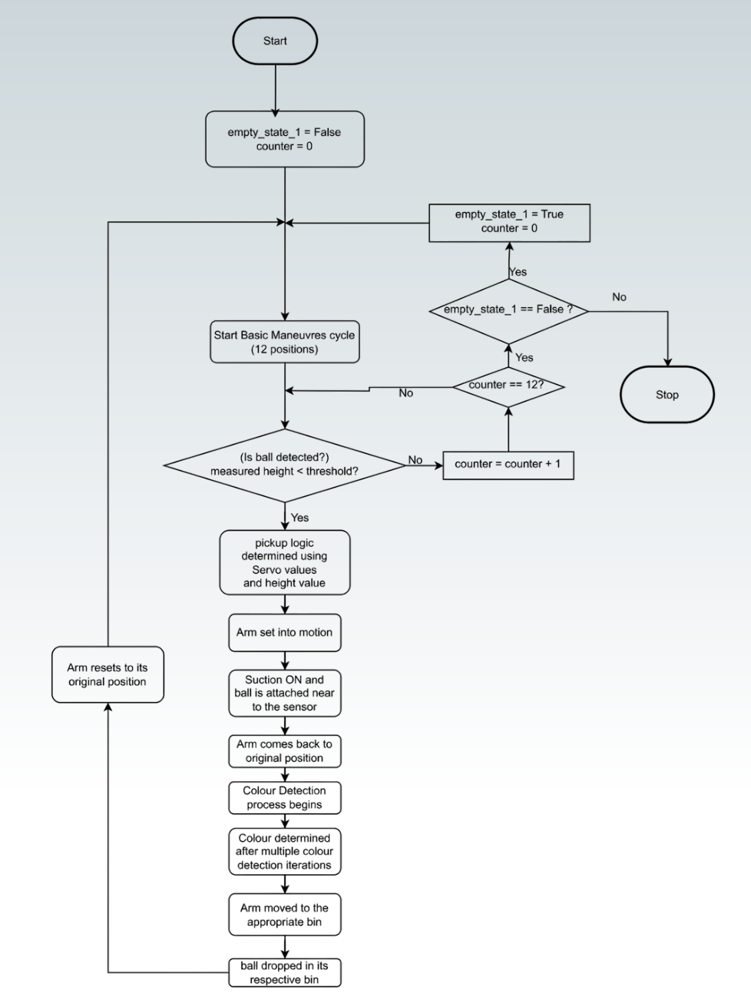
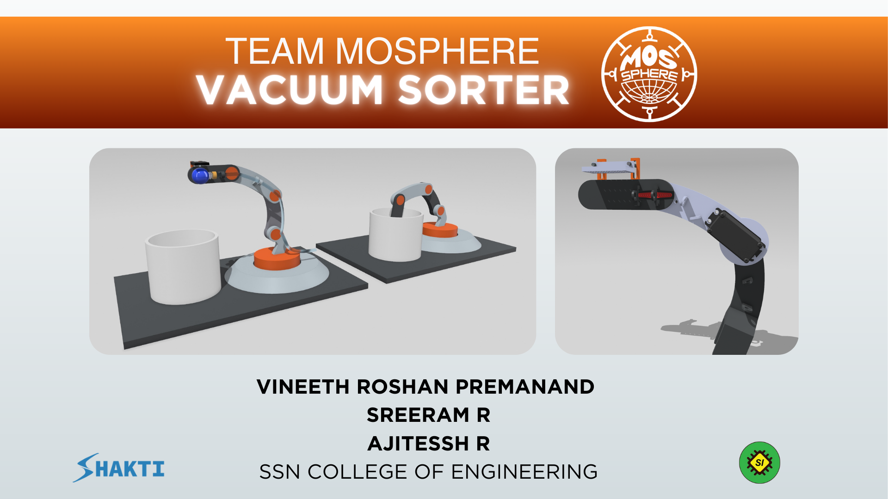

# SHAKTI-Based Robotic Sorting Arm

[](https://opensource.org/licenses/MIT)
[](./)
[](./)

A 4-DOF robotic arm that autonomously sorts objects by color, controlled by a SHAKTI RISC-V SoC running on a Nexys Video FPGA. This project was developed for the DIR-V 2025 National Hackathon and won **RUNNERS UP** in their flagship **48-hour hardware hackathon** winning us a cash prise of **Rs. 35000**. It showcases a minimalist and efficient approach to robotic automation through clever sensor integration and mechanical design.

### Collaborators

* [Ajitessh R](https://github.com/ajitessh) 
* [Sreeram R](https://github.com/Sreeram-Ramesh)
* [Vineeth Roshan Premanand](https://github.com/username)


## Key Features

* **RISC-V Control:** Utilizes the open-source SHAKTI C-Class SoC as the central processing unit for all logic, control, and I/O operations.
* **Dual-Function Sensing:** A single APDS-9960 sensor is used for both object proximity detection (to guide the arm) and color identification (R, G, B), significantly reducing component count and firmware complexity.
* **Vacuum Suction Gripper:** Employs a vacuum-based gripper instead of a traditional mechanical claw. This results in a lighter, faster, and more reliable design with fewer actuators and failure points.

<div align="center"></div><br>

* **Custom PCB Controller:** Features a custom-designed 2-layer PCB to cleanly integrate all sensors, servo motors, and power circuits with the main FPGA board.

<div align="center"></div><br>

## System Architecture

The system is a multi-disciplinary design combining custom mechanical parts, electronic hardware, and bare-metal firmware.

### 1. Mechanical Design

The arm is a 4-DOF (Degrees of Freedom) assembly driven by servo motors. The end-effector is a custom-designed vacuum suction gripper, chosen for its simplicity and speed over a mechanical alternative.

<div align="center"></div><br>

<div align="center"></div><br>

---

### 2. Hardware & Electronics

The electronic system is centered around the Nexys Video FPGA board, which hosts the SHAKTI SoC. A custom PCB acts as an interface shield for all external components.

<div align="center"></div><br>

* **FPGA Board:** Nexys Video (Xilinx Artix-7)
* **Processor:** SHAKTI C-Class RISC-V SoC
* **Sensor:** APDS-9960 (I2C interface) for proximity and color
* **Actuators:** MG995 and MG90S Servo Motors (PWM control)
* **Gripper:** Kamoer Diaphragm Pump controlled via a relay circuit

---

### 3. Firmware & Logic

The control application is a bare-metal C program developed using the SHAKTI SDK. The software is responsible for the entire operational flow, from scanning for objects to final placement.

<div align="center"></div><br>

The core algorithm performs the following steps:
1.  **Scan:** Executes a pre-programmed "Area Sweep Maneuver" to scan the collection bin for objects using the proximity sensor.
2.  **Approach & Pick:** Upon detecting an object, the arm positions the gripper and activates the vacuum pump.
3.  **Identify:** While the object is held, the APDS-9960 sensor determines its color.
4.  **Sort:** The arm rotates to the corresponding bin for the identified color.
5.  **Release:** The vacuum is released, dropping the ball.
6.  **Repeat:** The arm returns to the scanning maneuver until the bin is empty.

<div align="center"></div><br>

---

### SHAKTI SDK Build and Deploy Workflow

This guide outlines the steps to compile a C application using the SHAKTI SDK, and then load and execute it on the SHAKTI C-Class Core running on the Nexys Video FPGA.

### Prerequisites

1.  **SHAKTI SDK:** You require to clone the official SDK and add custom application code is located in the `i2c_applns`, `pwm_applns` and `pwmv2_applns` directory, to the `software/examples` of the main shakti-sdk.
2.  **RISC-V Toolchain:** The `riscv64-unknown-elf` toolchain is to be installed and in your system's PATH.
3.  **OpenOCD:** OpenOCD is to be installed and configured for the Nexys Video board.
4.  **Hardware:** The FPGA is programmed with the correct SHAKTI C-Class bitstream.

---

### Step 1: Start the Debug Server (OpenOCD)

This command starts the Open On-Chip Debugger, which creates a GDB server that acts as a bridge between your computer and the JTAG interface of the SHAKTI core on the FPGA.

1.  Open a new terminal.
2.  Navigate to the board support package directory:
    ```shell
    cd shakti-sdk/bsp/third_party/shaktiz
    ```
3.  Run OpenOCD with the correct configuration file:
    ```shell
    sudo $(which openocd) -f ftdi.cfg
    ```
4.  If successful, OpenOCD will be listening for connections. **Do not close this terminal.**

---

### Step 2: Build the Software Application

This step compiles your C code into an executable RISC-V binary (`.shakti` file).

1.  Open a **second terminal**.
2.  Navigate to the main SDK directory:
    ```shell
    cd /path/to/your/shakti-sdk
    ```
3.  Run the `make` command, specifying your application and the target SoC.
    * `PROGRAM`: The path to your application's C file relative to `software/examples/`.
    * `TARGET`: The target SoC, which is `shaktiz` for this setup.

    **Example for your Robotic Arm project:**
    ```shell
    make software PROGRAM=pwmmotor_v2/RoboticArm TARGET=shaktiz
    ```
4.  Verify that the build was successful by checking the `output` directory. It should contain three files: `.dump`, `.o`, and `.shakti`.

---

### Step 3: Load and Run the Code (GDB)

This step uses the RISC-V GNU Debugger (GDB) to connect to the OpenOCD server, load your compiled program into the FPGA's memory, and start its execution.

1.  In the same terminal as Step 2, launch the debugger:
    ```shell
    riscv64-unknown-elf-gdb
    ```
2.  Inside the GDB prompt, run the following commands in sequence.

    ```gdb
    # Set a long timeout to prevent connection issues
    set remotetimeout 240

    # Connect to the OpenOCD server running on your machine
    target remote :3333

    # Load your compiled application's symbols and code
    # NOTE: You load the .shakti file, NOT the .c file.
    file software/examples/pwmmotor_v2/RoboticArm/output/RoboticArm.shakti
    load

    # Continue execution (run the program)
    c
    ```
Your program is now running on the SHAKTI Core.

---

### Creating a New Project (Case 2)

To create a new application, the simplest method is to:
1.  Copy an existing example folder (e.g., `gpio`) that is similar to your needs.
2.  Rename the folder and the `.c` file inside to match your new project name.
3.  Modify the `Makefile` inside that directory, changing the `src` and `exe` variables to your new project name.

---

### Demonstration at the final evaluation at the end of 48-hrs

<a href="https://www.youtube.com/watch?v=qiLszU0Jg18"><div align="center"></div></a>

---